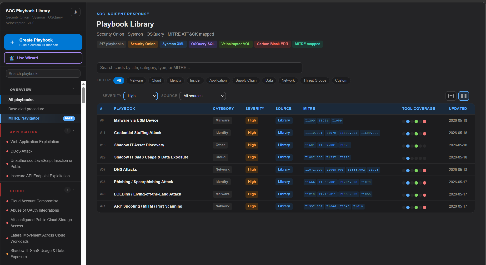

# SOC IR Playbook Library — Docker Deployment

Alpine + Apache serving the SOC Incident Response Playbook Library.
Custom playbooks created via the web form are persisted as JSON files
on a named Docker volume at `/playbooks` inside the container.



## Quick start

```bash
docker compose up -d

# Stop (volume data preserved)
docker compose down
```

Access at: **http://localhost:8080**

## Active tool tabs

The UI shows six query/tool tabs configured with `SIEM_TOOL_1` through
`SIEM_TOOL_6` in `docker-compose.yml`. This project defaults to the priority
SOC stack: Security Onion, Sysmon XML, OSQuery SQL, Velociraptor VQL, Elastic,
and Carbon Black. Other supported values include `splunk`, `kql`, `qradar`,
`sigma`, `chronicle`, `crowdstrike`, `defender`, `opensearch`, and `logrhythm`.

## MITRE ATT&CK group playbooks

Default threat-group playbooks are generated from the public MITRE ATT&CK
Enterprise STIX dataset. To refresh missing group playbooks and append them to
the default manifest, run:

```bash
python scripts/generate_mitre_group_playbooks.py
```

The generator creates one `Threat Groups` playbook per MITRE intrusion-set/group
ID (`Gxxxx`) and does not duplicate entries that already exist in the manifest.

## Volume management

```bash
# List saved custom playbooks
docker run --rm -v soc-playbooks_playbook-data:/playbooks alpine ls /playbooks

# Backup volume to current directory
docker run --rm \
  -v soc-playbooks_playbook-data:/playbooks:ro \
  -v $(pwd):/backup \
  alpine tar -czf /backup/playbooks-backup.tar.gz /playbooks

# Restore from backup
docker run --rm \
  -v soc-playbooks_playbook-data:/playbooks \
  -v $(pwd):/backup \
  alpine tar -xzf /backup/playbooks-backup.tar.gz -C /
```

## Update the app (no data loss)

```bash
# Replace index.html or CGI scripts, then rebuild
docker compose up -d --build
# The playbook-data volume is untouched — custom playbooks survive the rebuild
```

## Air-gapped deployment

```bash
# Export on internet-connected host
docker save soc-playbooks:latest | gzip > soc-playbooks-v4.tar.gz

# On the air-gapped host
docker load < soc-playbooks-v4.tar.gz
docker compose up -d
```
